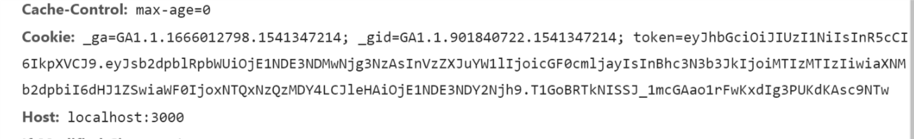

# 說明文件

## 指令
1. 安裝依賴包
```
npm install / cnpm install
```
2. 運行
```
npm start
```
3. 打包
```
npm run build
```

## 數據庫
1. 建表
```sql
create database gallery;
use gallery;
create table g_user(
`username` varchar(20) primary key,
`password` varchar(20)
);
```

## 安全性

1. 用戶登錄時使用下圖生成 jwt 的 Token, 並返回給用戶

```javascript
const token = jwt.sign(
  {
    loginTime: Date.now(),
    username: user.getUsername(),
    password: user.getPassword(),
    isLogin: false
  },
  secret,
  { expiresIn: "1h" }
);
```

2. 用戶將 token 保存在 cookie

```javascript
// in ajax get success callback function
response = JSON.parse(response);
if (response.isValid) {
  document.cookie = "token=" + response.token + ";";
}
```
3. 用戶登錄後訪問頁面, 在cookie中攜帶token


4. 檢證token有效性, 若有效則正常訪問, 否則重導向至登錄頁面
```typescript
/**
 * @param {Request} req
 * @param {Response} res
 * @param {string} url
 */
function checkToken(
  req: Request,
  res: Response,
  url: string | null,
  errorUrl: string = "/redirect"
): User | null {
  const token: string | undefined = req.cookies.token;
  if (token) {
    try {
      const decoded = jwt.verify(token, secret);
      if (decoded.isLogin) {
        if (url) {
          res.sendfile(url);
        } else {
          return new User(decoded.username, decoded.password);
        }
      } else {
        res.redirect(errorUrl);
      }
    } catch (err) {
      console.log(err);
      res.redirect(errorUrl);
      return null;
    }
  }
  return null;
}
```

5. 用戶可以選擇登出, 返回新的token表示已登出
```typescript
router.get("/logout", (req: Request, res: Response) => {
  const user: User | null = checkToken(req, res, null);

  if (!user) {
    res.redirect("public/pages/redirect.html");
  } else {
    const token = jwt.sign(
      {
        loginTime: Date.now(),
        username: user.getUsername(),
        password: user.getPassword(),
        isLogin: false
      },
      secret,
      { expiresIn: "1h" }
    );
    res.end(
      JSON.stringify({
        isValid: true,
        message: "logout success",
        token: token
      })
    );
  }
});
```

6. 對用戶的密碼進行hash加密, 再保存
```typescript
  /**
   * @private
   * @param {string} pw
   * @returns {string}
   * @memberof UserService
   */
  private fromPasswordToHash(pw: string): string {
    const hash = crypto.createHash("md5");
    hash.update(pw);
    let ret = hash.digest("hex");
    return ret;
  }
```
