# 說明文件

## 指令

1. 安裝依賴包

```
npm install / cnpm install
```

2. 運行

```
npm start
```

3. 打包

```
npm run build
```

## 數據庫

### 建表

```sql
create database gallery;
use gallery;
create table g_user(
`username` varchar(20) primary key,
`password` varchar(20)
);
create table g_image(
  `id` int primary key auto_increment,
  `username` varchar(20),
  `image_path` varchar(200),
  `tags` varchar(100)
)
```

### 數據

```sql
-- MySQL dump 10.13  Distrib 8.0.13, for Win64 (x86_64)
--
-- Host: localhost    Database: gallery
-- ------------------------------------------------------
-- Server version	8.0.13

/*!40101 SET @OLD_CHARACTER_SET_CLIENT=@@CHARACTER_SET_CLIENT */;
/*!40101 SET @OLD_CHARACTER_SET_RESULTS=@@CHARACTER_SET_RESULTS */;
/*!40101 SET @OLD_COLLATION_CONNECTION=@@COLLATION_CONNECTION */;
 SET NAMES utf8 ;
/*!40103 SET @OLD_TIME_ZONE=@@TIME_ZONE */;
/*!40103 SET TIME_ZONE='+00:00' */;
/*!40014 SET @OLD_UNIQUE_CHECKS=@@UNIQUE_CHECKS, UNIQUE_CHECKS=0 */;
/*!40014 SET @OLD_FOREIGN_KEY_CHECKS=@@FOREIGN_KEY_CHECKS, FOREIGN_KEY_CHECKS=0 */;
/*!40101 SET @OLD_SQL_MODE=@@SQL_MODE, SQL_MODE='NO_AUTO_VALUE_ON_ZERO' */;
/*!40111 SET @OLD_SQL_NOTES=@@SQL_NOTES, SQL_NOTES=0 */;

--
-- Table structure for table `g_image`
--

DROP TABLE IF EXISTS `g_image`;
/*!40101 SET @saved_cs_client     = @@character_set_client */;
 SET character_set_client = utf8mb4 ;
CREATE TABLE `g_image` (
  `id` int(11) NOT NULL AUTO_INCREMENT,
  `username` varchar(25) DEFAULT NULL,
  `image_path` varchar(200) DEFAULT NULL,
  `tags` varchar(100) DEFAULT NULL,
  PRIMARY KEY (`id`)
) ENGINE=InnoDB AUTO_INCREMENT=60 DEFAULT CHARSET=utf8mb4 COLLATE=utf8mb4_0900_ai_ci;
/*!40101 SET character_set_client = @saved_cs_client */;

--
-- Dumping data for table `g_image`
--

LOCK TABLES `g_image` WRITE;
/*!40000 ALTER TABLE `g_image` DISABLE KEYS */;
INSERT INTO `g_image` VALUES (53,'test123','./upload_images/586d24d024d4ff46368c0634f6ae5b.png',' 水果 点心'),(54,'test123','./upload_images/2df807bfed1c9276503e8fd8a10d2c.png',' 点心 盘子 菜品'),(55,'test123','./upload_images/20e0ae269dcb76c383bb27771d7ad0.png',' 花 蛋糕'),(56,'test123','./upload_images/5e8b525a60a1a4032e78814887bee6.png',' 女孩 小孩'),(57,'test123','./upload_images/6d27b5a7c47fbb2ff1eff0dc65bf23.png',' 主食 盘子 碗 菜品'),(58,'test123','./upload_images/43d313fab3906486e1d40795c00560.png',' 菜品'),(59,'test123','./upload_images/a6a14d64f28a498daafd6880548abf.png',' 盘子 菜品');
/*!40000 ALTER TABLE `g_image` ENABLE KEYS */;
UNLOCK TABLES;

--
-- Table structure for table `g_user`
--

DROP TABLE IF EXISTS `g_user`;
/*!40101 SET @saved_cs_client     = @@character_set_client */;
 SET character_set_client = utf8mb4 ;
CREATE TABLE `g_user` (
  `username` varchar(20) NOT NULL,
  `password` varchar(100) DEFAULT NULL,
  PRIMARY KEY (`username`)
) ENGINE=InnoDB DEFAULT CHARSET=utf8mb4 COLLATE=utf8mb4_0900_ai_ci;
/*!40101 SET character_set_client = @saved_cs_client */;

--
-- Dumping data for table `g_user`
--

LOCK TABLES `g_user` WRITE;
/*!40000 ALTER TABLE `g_user` DISABLE KEYS */;
INSERT INTO `g_user` VALUES ('test123','4297f44b13955235245b2497399d7a93');
/*!40000 ALTER TABLE `g_user` ENABLE KEYS */;
UNLOCK TABLES;
/*!40103 SET TIME_ZONE=@OLD_TIME_ZONE */;

/*!40101 SET SQL_MODE=@OLD_SQL_MODE */;
/*!40014 SET FOREIGN_KEY_CHECKS=@OLD_FOREIGN_KEY_CHECKS */;
/*!40014 SET UNIQUE_CHECKS=@OLD_UNIQUE_CHECKS */;
/*!40101 SET CHARACTER_SET_CLIENT=@OLD_CHARACTER_SET_CLIENT */;
/*!40101 SET CHARACTER_SET_RESULTS=@OLD_CHARACTER_SET_RESULTS */;
/*!40101 SET COLLATION_CONNECTION=@OLD_COLLATION_CONNECTION */;
/*!40111 SET SQL_NOTES=@OLD_SQL_NOTES */;

-- Dump completed on 2018-12-05  4:21:25
```

### 截圖

1. 用戶表 g_user
   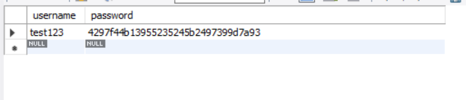
2. 圖片表 g_image
   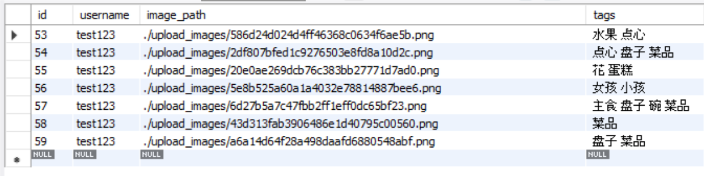

## 功能

### 登錄/注冊

1. 登錄

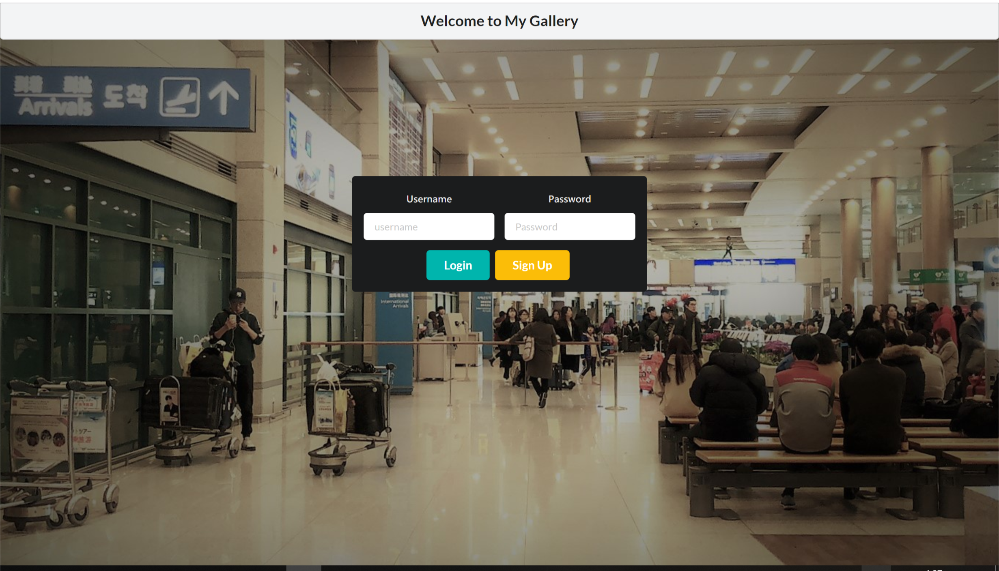

2. 注冊

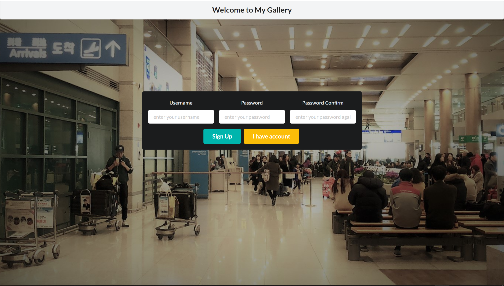

3. 注冊時的格式提醒


4. 格式錯誤時的提醒

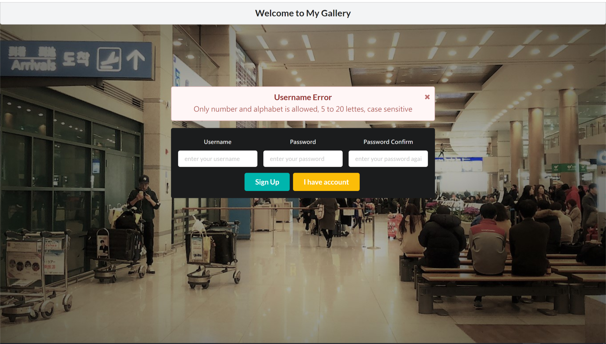

5. 驗證碼

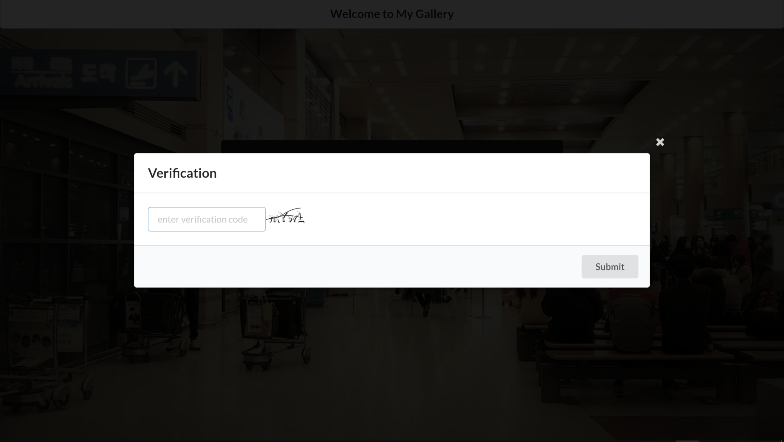

### 瀏覽圖片及圖片標籤

1. 瀏覽圖片

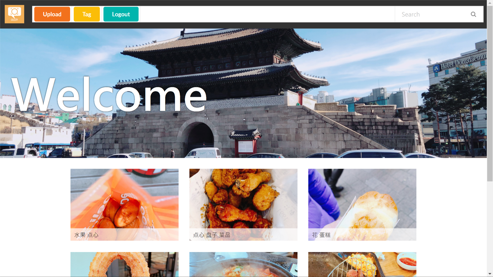

2. 上載圖片及增加標籤
   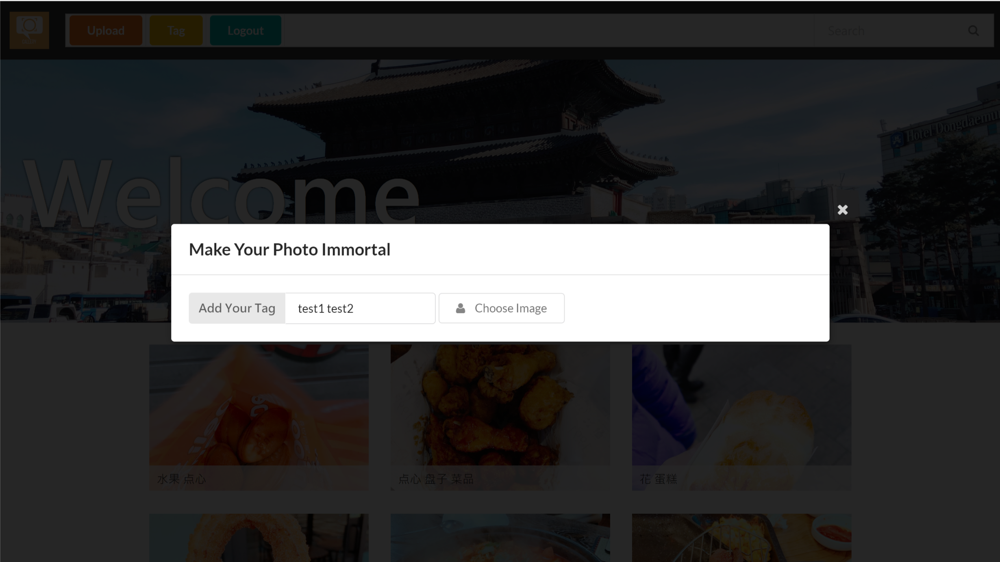

3. 自動標籤(紅圈)
   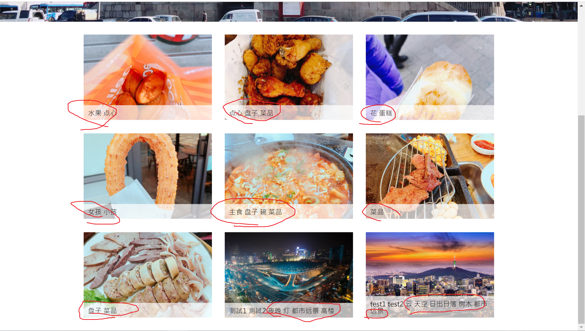

4. 標籤統計(出現次數)

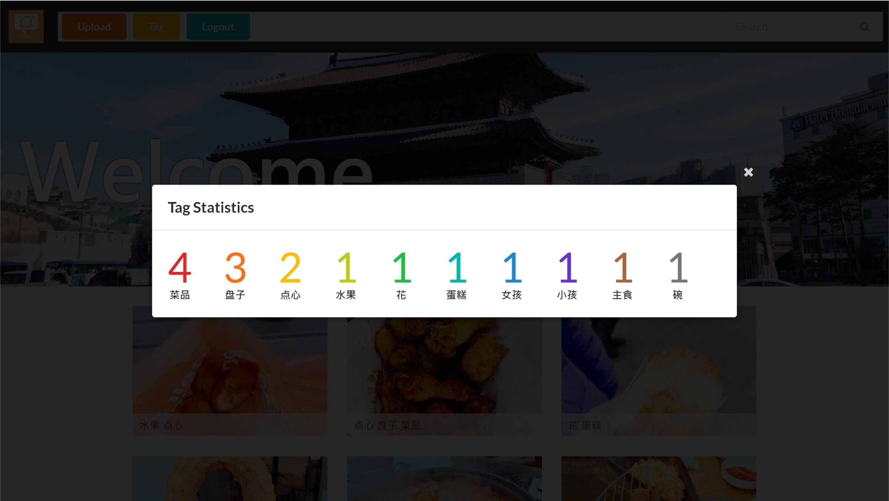

5. 關鍵字查找

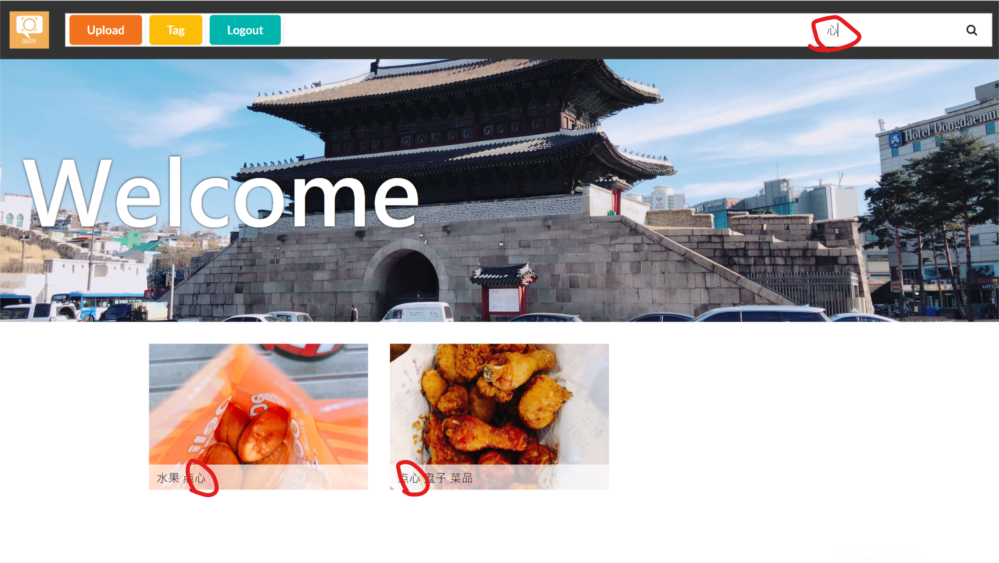

### 圖片編輯

1. 合成、畫筆、文字、移動和縮放

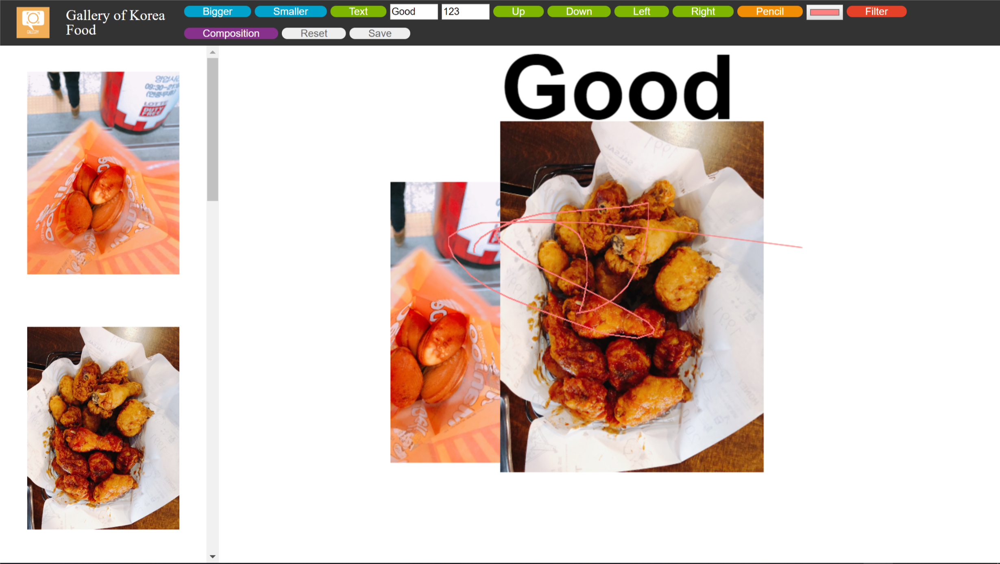

## 調用的 RESTFUL API

-   調用騰訊 AI 開放平台的圖片標籤功能
-   目標是根據圖片內容自動增加標籤
-   部份代碼以下所示

```typescript
   /**
     *
     *
     * @param {string} base64Image
     * @returns {Promise<string[]>}
     * @memberof AIService
     */
    public tagOf(base64Image: string): Promise<string[]> {
        const url = "https://api.ai.qq.com/fcgi-bin/image/image_tag";
        let data = {
            app_id: this.appId,
            image: base64Image,
            time_stamp: Math.floor(new Date().getTime() / 1000),
            nonce_str: Math.floor(new Date().getTime() / 1000)
        };

        data["sign"] = this.getSign(data);

        return new Promise((resolve, reject) => {
            request.post(
                {
                    url: url,
                    headers: {
                        "content-type": "application/x-www-form-urlencoded"
                    },
                    form: data
                },
                function(error, response, body) {
                    if (!error && response.statusCode == 200) {
                        let jsonObj = JSON.parse(body);
                        let tagList: string[] = [];
                        for (let tag of jsonObj["data"]["tag_list"]) {
                            tagList.push(tag["tag_name"]);
                        }
                        console.log(tagList);
                        resolve(tagList);
                    } else {
                        reject(error);
                    }
                }
            );
        });
```

## 重構

-   後台改使用 typescipt
-   美化界面
-   將上傳圖片的功能從圖片編輯頁面移到瀏覽圖片頁面

## 安全性

1. 用戶登錄時使用下圖生成 jwt 的 Token, 並返回給用戶

```javascript
const token = jwt.sign(
    {
        loginTime: Date.now(),
        username: user.getUsername(),
        password: user.getPassword(),
        isLogin: false
    },
    secret,
    { expiresIn: "1h" }
);
```

2. 用戶將 token 保存在 cookie

```javascript
// in ajax get success callback function
response = JSON.parse(response);
if (response.isValid) {
    document.cookie = "token=" + response.token + ";";
}
```

3. 用戶登錄後訪問頁面, 在 cookie 中攜帶 token
   

4. 檢證 token 有效性, 若有效則正常訪問, 否則重導向至登錄頁面

```typescript
/**
 * @param {Request} req
 * @param {Response} res
 * @param {string} url
 */
function checkToken(
    req: Request,
    res: Response,
    url: string | null,
    errorUrl: string = "/redirect"
): User | null {
    const token: string | undefined = req.cookies.token;
    if (token) {
        try {
            const decoded = jwt.verify(token, secret);
            if (decoded.isLogin) {
                if (url) {
                    res.sendfile(url);
                } else {
                    return new User(decoded.username, decoded.password);
                }
            } else {
                res.redirect(errorUrl);
            }
        } catch (err) {
            console.log(err);
            res.redirect(errorUrl);
            return null;
        }
    }
    return null;
}
```

5. 用戶可以選擇登出, 返回新的 token 表示已登出

```typescript
router.get("/logout", (req: Request, res: Response) => {
    const user: User | null = checkToken(req, res, null);

    if (!user) {
        res.redirect("public/pages/redirect.html");
    } else {
        const token = jwt.sign(
            {
                loginTime: Date.now(),
                username: user.getUsername(),
                password: user.getPassword(),
                isLogin: false
            },
            secret,
            { expiresIn: "1h" }
        );
        res.end(
            JSON.stringify({
                isValid: true,
                message: "logout success",
                token: token
            })
        );
    }
});
```

6. 對用戶的密碼進行 hash 加密, 再保存

```typescript
  /**
   * @private
   * @param {string} pw
   * @returns {string}
   * @memberof UserService
   */
  private fromPasswordToHash(pw: string): string {
    const hash = crypto.createHash("md5");
    hash.update(pw);
    let ret = hash.digest("hex");
    return ret;
  }
```
